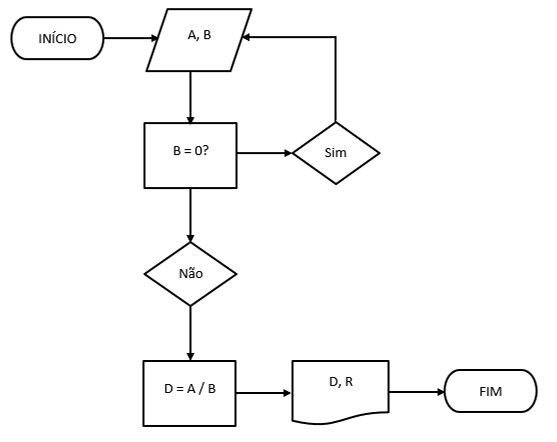
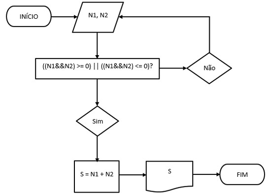

# ✅ Exercício 1 – Passos da divisão com quociente inteiro

Este exercício consiste em descrever, de forma narrativa, como dividir dois números (A e B) com quociente inteiro. A abordagem utilizada considera as seguintes etapas:

1. Solicitar o valor do dividendo (A).
2. Solicitar o valor do divisor (B).
3. Se o divisor for igual a zero, volte ao passo 2.
4. Realizar a divisão A / B.
5. Apresentar o quociente e o resto, verificando se os números são múltiplos ou não.

Essa estrutura garante que o programa evite divisões inválidas (por zero) e interprete corretamente o tipo de divisão realizada.

---

# 🔁 Exercício 2 – Fluxograma da divisão

Neste exercício foi construído um fluxograma que representa os passos descritos no exercício 1, com ênfase em:

- Verificar se o divisor é zero antes da divisão;
- Calcular quociente e resto de forma condicional;
- Exibir o resultado de acordo com as condições.

## 📊 Fluxograma

---

# ➕ Exercício 3 – Fluxograma da soma de dois números reais

Foi elaborado um fluxograma para ilustrar o processo de soma de dois números reais. Os elementos principais são:

- Receber os dois valores (v1 e v2);
- Realizar a operação `soma = v1 + v2`;
- Exibir o resultado da soma no terminal.

## 📊 Fluxograma

---

# 💻 Exercício 4 – Programa de soma com valores fixos

Este programa realiza a soma de dois números reais definidos diretamente no código (v1 = 5.0 e v2 = 2.5).

### 🔧 Lógica aplicada:

1. Declarar e inicializar duas variáveis `v1` e `v2` com valores reais;
2. Realizar a soma e armazenar o resultado em uma terceira variável `soma`;
3. Imprimir o resultado com as três variáveis no terminal.

Este exercício não exige interação com o usuário.

Arquivo relacionado: `soma.cpp`

---

# 🎯 Exercício 5 – Programa de soma com entrada do usuário

Diferente do exercício anterior, este programa solicita que o usuário insira dois valores reais pelo terminal. A partir disso:

### 🔧 Lógica aplicada:

1. Utiliza-se `cin` para capturar os valores de entrada (`n1` e `n2`);
2. Os valores são somados e armazenados em `soma`;
3. O resultado é exibido ao usuário utilizando `cout`.

Este exercício introduz o conceito de entrada interativa no programa.

Arquivo relacionado: `soma2.cpp`

---
